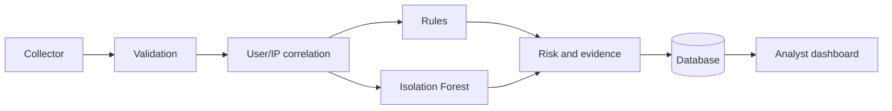

# SentinelScope — Explainable Security Monitoring

[](https://github.com/bbmuti/SecureOps/actions/workflows/ci.yml)
[](https://www.python.org/)
[](https://react.dev/)
[](LICENSE)

SentinelScope is a security-monitoring application built around authentication and API activity. It collects events from Linux, Windows, and JSON sources; applies rule-based detections and Isolation Forest anomaly scoring; and presents the result as evidence-backed alerts for an analyst.

I built it to explore a practical question: how can an alert show *why* an event is risky instead of returning only a malicious/benign label? The result is a portfolio-scale system covering event normalization, detection, secure sessions, data modeling, an analyst dashboard, containers, and automated quality checks.

> SentinelScope is the application in this `SecureOps` repository. It is an educational defensive-security project, not a production SIEM. The included simulator writes synthetic events to the local application and does not scan external systems.

## Screenshots

These screenshots come from the Playwright analyst flow used in CI. The flow uses synthetic identities and [documentation-reserved IP addresses](https://datatracker.ietf.org/doc/html/rfc5737).

[](docs/assets/dashboard-overview.png)

*Overview with alert priority, severity distribution, telemetry sources, and recent events. Click for the full-size image.*

[](docs/assets/explainable-alert.png)

*An alert investigation view showing the risk score, evidence, ATT&CK context, and triage status. Click for the full-size image.*

## What it does

- Normalizes JSON/JSONL, Linux OpenSSH, and Windows Security Event Log records.
- Detects brute-force attempts, unusual login hours, repeated authorization failures, denied role changes, and rapid country changes.
- Uses a personal behavioral baseline after enough successful events; otherwise it falls back to a deterministic global baseline.
- Produces a 0–100 risk score with human-readable evidence and MITRE ATT&CK context.
- Prevents collector replays with stable source identifiers and a database uniqueness constraint.
- Supports alert investigation states: `open`, `investigating`, `resolved`, and `false_positive`.
- Records security-sensitive actions in an audit trail.

## How an event becomes an alert



1. Pydantic validates the event type, timestamp, IP address, outcome, and payload limits.
2. The API loads earlier events for the same user or IP inside a 10-minute window.
3. Detection rules describe any recognizable pattern and attach supporting evidence.
4. Isolation Forest scores six behavioral features, including login time, outcome, role, sensitive action, and same-IP activity.
5. Rule and anomaly scores are combined. A score of `50` or above creates an alert.

ATT&CK mappings are used as investigation context, not as proof of attacker intent. The same is true of an anomaly score: it prioritizes review but does not establish that an attack occurred.

## Engineering decisions

| Decision | Reason |
|---|---|
| Rules plus anomaly scoring | Rules remain easy to explain, while the model can highlight behavior that is not covered by a fixed signature. |
| User/IP-scoped correlation | Unrelated high-volume traffic should not push relevant events out of the detection window. |
| HttpOnly refresh cookie | The long-lived token is not exposed to browser JavaScript. Rotation, CSRF validation, and family revocation limit replay risk. |
| Idempotent ingestion | A collector retry should not create a second event or duplicate alert. |
| PostgreSQL in deployment, SQLite in tests | PostgreSQL represents the intended data layer; SQLite keeps local tests fast. A PostgreSQL smoke test covers dialect-specific behavior in CI. |
| Separate benchmark harness | BETH process telemetry can evaluate the Isolation Forest approach, but it cannot measure the complete authentication/API pipeline. |

The API is split into authentication, event, analyst-workflow, and system routers. Detection and session logic live in separate service modules so the application entry point stays small.

## Technology

| Area | Stack |
|---|---|
| Backend | Python 3.12, FastAPI, Pydantic, SQLAlchemy, Alembic |
| Detection | scikit-learn, NumPy, Isolation Forest |
| Frontend | React 19, Vite, Lucide |
| Data | PostgreSQL; SQLite for local tests |
| Delivery | Docker Compose, Nginx, GitHub Actions, Dependabot, CodeQL |

## Run with Docker

Requirements: Docker Engine with Compose v2.

```bash
cp .env.example .env
```

Set independent values for `JWT_SECRET`, `ADMIN_PASSWORD`, and `INGESTION_API_KEY`, then run:

```bash
docker compose up --build
```

Open <http://localhost:5173>. The same address exposes `/health` and `/ready` through Nginx. PostgreSQL and the FastAPI container remain on the internal Compose network.

## Local development

Requirements: Python 3.12 and Node.js 22.

```bash
cd backend
python -m venv .venv
source .venv/bin/activate          # Windows: .venv\Scripts\activate
pip install -r requirements.txt -r requirements-dev.txt
cp ../.env.example .env
alembic upgrade head
uvicorn app.main:app --reload
```

In another terminal:

```bash
cd frontend
npm ci
npm run dev
```

The development server proxies `/api`, `/health`, and `/ready` to FastAPI. Swagger UI is available at <http://localhost:8000/docs> outside production mode.

## Send sample or collector data

Set the ingestion key used by the API:

```bash
export SENTINELSCOPE_INGESTION_KEY="your-ingestion-key"
```

Send the JSONL sample from the repository root:

```bash
python examples/python_collector.py examples/sample_events.jsonl
```

Preview a Linux OpenSSH record without sending it:

```bash
cd backend
python -m scripts.collect_linux_auth --file ../examples/sample_auth.log --dry-run
```

On Windows, run PowerShell with permission to read the Security log:

```powershell
$env:SENTINELSCOPE_INGESTION_KEY="your-ingestion-key"
powershell -ExecutionPolicy Bypass -File collectors/windows_security_eventlog.ps1 -DryRun
```

The Windows collector normalizes event IDs `4624` and `4625` and saves its last processed record ID after a successful send. Each collector exposes its available paths and runtime options through `--help`.

## Tests and automated checks

```bash
cd backend
python -m pytest --cov=app --cov-report=term-missing --cov-fail-under=90
ruff check app tests scripts migrations
bandit -q -r app scripts ../examples
pip-audit -r requirements.txt -r requirements-dev.txt

cd ../frontend
npm test
npm run build
npm run test:e2e       # requires Playwright Chromium
```

Current verification records **63 backend tests**, **7 frontend tests**, and more than **93% backend branch coverage**. CI also runs a clean Alembic migration, PostgreSQL API smoke test, Windows collector validation, dependency audits, container builds, CodeQL, and the Playwright analyst flow.

## BETH benchmark

The external benchmark trains three Isolation Forest models on the public BETH v3 process-event dataset and combines their scores. Its threshold is selected from the separate benign validation split before the labelled test split is evaluated.

| Metric | Result on the 100,000-record test sample |
|---|---:|
| Precision | 97.29% |
| Recall | 91.45% |
| F1 | 94.28% |
| ROC-AUC | 84.12% |
| Benign false-positive rate | 13.27% |

The false-positive rate is too high for an operational claim, and one individual seed is unstable under the test distribution shift. For that reason, this result is presented only as an evaluation of the anomaly-detection approach on process telemetry—not as SentinelScope's attack-detection accuracy.

The exact sampling method, dataset hashes, seed-level results, bootstrap intervals, and random baseline are available in [BENCHMARKING.md](docs/BENCHMARKING.md) and the [versioned JSON report](backend/artifacts/beth-benchmark.json).

## Known limitations

- The fallback behavioral model is trained on synthetic normal activity until a user has enough history.
- Personal models are cached in memory and are not stored in a model registry or monitored for drift.
- Rapid country change uses event-provided country codes; it does not perform GeoIP lookup or travel-speed calculation.
- Login throttling is process-local and would need Redis or another shared store for multiple API replicas.
- The dashboard polls every 10 seconds instead of using a streaming transport.
- The project has one seeded administrator and no MFA, SSO, multi-tenancy, notification integration, or case-management workflow.
- An internet-facing deployment would still need managed secrets, TLS termination, backups, centralized observability, and an external security review.

## Documentation

- [Threat model](docs/THREAT_MODEL.md)
- [Benchmark methodology](docs/BENCHMARKING.md)
- [90-second demo flow](docs/DEMO.md)
- [CV and interview notes](docs/CV_PROJECT_DESCRIPTION.md)
- [Security policy](SECURITY.md)
- [Contributing guide](CONTRIBUTING.md)

## Author

Created by [Begüm Beren Mutioğlu](https://github.com/bbmuti), a Computer Engineering student interested in IT infrastructure and defensive security.

Licensed under the [MIT License](LICENSE).
